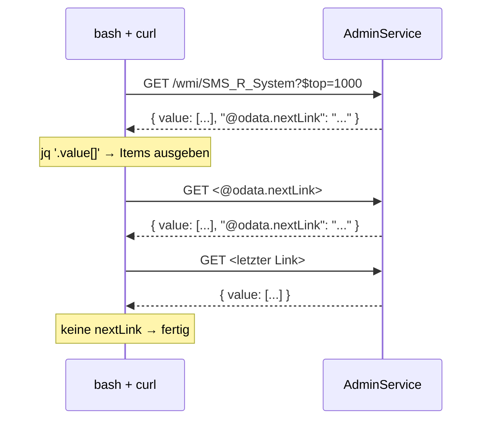
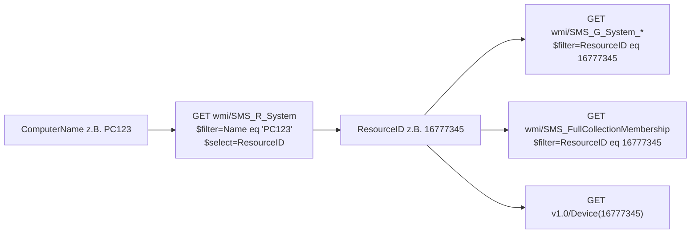
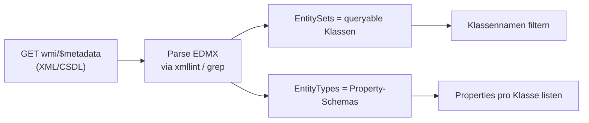

# Demo-Skripte — AdminService via Bash + curl

Sammlung von Skripten, die zeigen, **was sich ueber den ConfigMgr-AdminService
abfragen laesst** — komplett ohne PowerShell, nur mit `curl` und `jq`. Jedes
Skript ist standalone, nutzt `_common.sh` fuer Auth-Setup.

## Setup

```bash
export CONFIGMGR_ADMINSERVICE_BASE='https://sccm.corp.local/AdminService'
# Optional fuer Demo-Umgebungen ohne CA-Trust:
# export CONFIGMGR_SKIP_CERT_CHECK=true
kinit -kt /etc/krb5.keytab svc-tofu@DOMAIN.LOCAL

# Tools:
sudo apt install curl jq krb5-user libxml2-utils    # libxml2-utils nur fuer 090
```

## Uebersicht

| # | Skript | Was es zeigt | Genutzte Endpoints |
|---|---|---|---|
| 010 | `010-list-devices.sh` | Device-Listing, Filter, Pagination | `wmi/SMS_R_System` |
| 020 | `020-device-full.sh` | Stammdaten + Hardware-Inventory eines Device | `SMS_R_System`, `SMS_G_System_COMPUTER_SYSTEM`, `_OPERATING_SYSTEM`, `_PC_BIOS`, `_PROCESSOR`, `_LOGICAL_DISK` |
| 030 | `030-device-software.sh` | Installierte Software pro Device | `wmi/SMS_G_System_INSTALLED_SOFTWARE` |
| 040 | `040-device-collections.sh` | Welche Collections enthalten ein Device? | `SMS_FullCollectionMembership`, `SMS_Collection` |
| 050 | `050-collection-members.sh` | Members einer Collection | `SMS_Collection`, `SMS_FullCollectionMembership` |
| 060 | `060-deployments.sh` | Aktive **und/oder** zukuenftig geplante Deployments | `wmi/SMS_DeploymentInfo` |
| 070 | `070-task-sequence-status.sh` | Task-Sequence-Status-Historie | `wmi/SMS_TaskSequenceDeploymentStatus` |
| 080 | `080-client-health.sh` | Client-Health-Summary (auch "nur unhealthy") | `wmi/SMS_CH_ClientSummary` |
| 090 | `090-discover-classes.sh` | **Meta:** alle queryable Klassen via `$metadata` | `wmi/$metadata` |
| 100 | `100-modeled-api.sh` | Tour durch `/v1.0/`-Namespace | `v1.0/`, `v1.0/Device`, `v1.0/Collection` |

## Was sich noch alles abfragen laesst

Ueber `090-discover-classes.sh` siehst du EntitySets fuer:

- **Discovery / Stammdaten:** `SMS_R_System`, `SMS_R_User`, `SMS_R_UserGroup`, `SMS_R_IPSubnet`, `SMS_R_ADGroup`
- **Hardware-Inventory** (rund 100 Klassen, je nach Inventory-Settings): `SMS_G_System_*` — Computer, OS, BIOS, CPU, RAM, Disks, Network, Battery, Monitor, USB, Drivers, Services, Processes, Installed Programs/Software, Updates, …
- **Custom Hardware Inventory:** alles, was per MOF erweitert wurde — taucht ebenfalls als `SMS_G_System_*` auf
- **Software-Updates:** `SMS_SoftwareUpdate`, `SMS_UpdateGroupAssignment`, `SMS_UpdateContentInfo`
- **Apps & Pakete:** `SMS_Application`, `SMS_DeploymentType`, `SMS_Package`, `SMS_Program`
- **Compliance:** `SMS_ConfigurationItem`, `SMS_Baseline`, `SMS_G_System_CI_ComplianceState`
- **Status / Health:** `SMS_StatusMessage`, `SMS_CH_ClientSummary`, `SMS_CombinedDeviceResources`
- **Site / Infra:** `SMS_Site`, `SMS_DistributionPoint`, `SMS_ManagementPoint`, `SMS_BoundaryGroup`, `SMS_Boundary`
- **Deployments:** `SMS_DeploymentInfo`, `SMS_DeploymentSummary`, `SMS_AppDeploymentAssetDetails`, `SMS_TaskSequenceDeploymentStatus`
- **Task Sequences:** `SMS_TaskSequencePackage`, `SMS_TaskSequenceStep`
- **Collections:** `SMS_Collection`, `SMS_CollectionRule`, `SMS_FullCollectionMembership`

Im **`v1.0/`-Namespace** sind die jeweils kuratierten/saubereren Pendants
(z.B. `v1.0/Device`, `v1.0/Collection`, `v1.0/Application`,
`v1.0/SoftwareUpdate`, `v1.0/Deployment`).

## Wiederkehrende Ablaeufe

### Pagination via `@odata.nextLink`



Implementiert in `as_get_paged` in `_common.sh`.

### Resolve-by-Name (Computer-Name → ResourceID → Detaildaten)



`resolve_resource_id` in `_common.sh` kapselt Schritt 1+2.

### Class-Discovery via `$metadata`



Implementiert in `090-discover-classes.sh`.

## Tipps fuer eigene Erweiterungen

- **OData-Operatoren in der URL escapen:** `$` muss im Bash-Kontext via
  Backslash escaped werden (`\$filter=...`), Leerzeichen als `%20`.
- **Erst klein, dann breit:** mit `$top=1` testen, dann Pagination.
- **Immer `$select` benutzen:** sonst kommen 50+ Spalten zurueck.
- **`$filter` mit `and`/`or`:** Operatoren `eq`, `ne`, `gt`, `lt`, `ge`, `le`,
  Funktionen `startswith`, `endswith`, `contains`, `year(x)`, `month(x)`.
- **Datetime:** ISO-8601 mit `Z`, also
  `StartTime gt 2026-04-30T00:00:00Z`.
- **Property-Casing ist nicht konsistent:** ConfigMgr mischt
  `ResourceID`/`ResourceId`, `OperatingSystemNameandVersion`. Im Zweifel via
  `090-discover-classes.sh <pattern> properties` nachsehen.
- **`jq -r` fuer Tabellen:** `jq -r '[.a, .b] | @tsv'` + `column -t -s $'\t'`
  liefert lesbare Tabellen.
