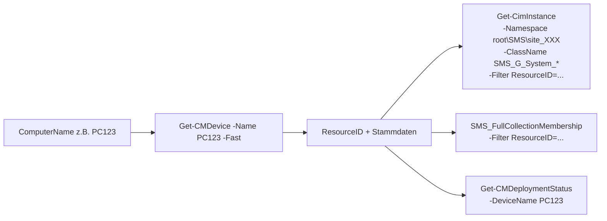
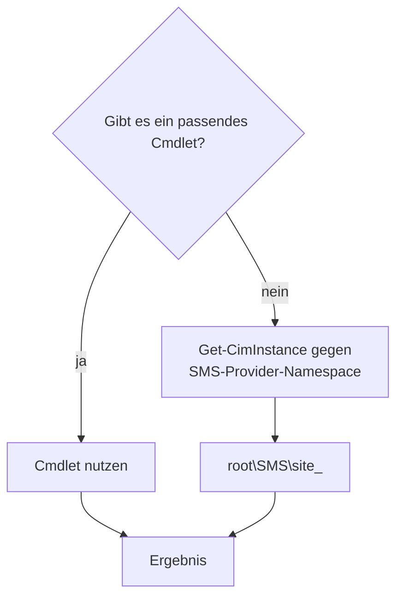

# Demo-Skripte — WinRM-Jumphost (ConfigMgr-Console-Cmdlets)

Sammlung von 10 Skripten, die zeigen was sich ueber die
**ConfigurationManager-PowerShell-Cmdlets** abfragen laesst — laufen direkt
auf dem Jumphost (oder einem Server mit installierter Console / Cmdlet-Package).

Alle Skripte sind in **Windows-PowerShell-5.1-kompatiblem Stil** geschrieben
und laufen sowohl in 5.1 als auch in pwsh 7.

## Setup

```powershell
# Auf dem Jumphost (oder einem System mit installierter ConfigMgr-Console):
$env:CONFIGMGR_SITE_CODE   = 'P01'
$env:CONFIGMGR_SITE_SERVER = 'sccm.corp.local'    # optional, default = hostname

# Demo aufrufen
.\010-list-devices.ps1
```

`_common.ps1` laedt das ConfigurationManager-Modul, registriert das
PSDrive und macht WMI/CIM-Queries gegen den Site-Provider verfuegbar.

## Uebersicht

| # | Skript | Was es zeigt | Genutzte Cmdlets / Klassen |
|---|---|---|---|
| 010 | `010-list-devices.ps1` | Device-Listing mit Filter | `Get-CMDevice -Fast` |
| 020 | `020-device-full.ps1` | Stammdaten + HW-Inventory eines Device | `Get-CMDevice`, `SMS_G_System_COMPUTER_SYSTEM`, `_OPERATING_SYSTEM`, `_PC_BIOS`, `_PROCESSOR`, `_LOGICAL_DISK` |
| 030 | `030-device-software.ps1` | Installierte Software | `SMS_G_System_INSTALLED_SOFTWARE` (via WMI) |
| 040 | `040-device-collections.ps1` | Collections eines Device | `SMS_FullCollectionMembership` + `Get-CMCollection` |
| 050 | `050-collection-members.ps1` | Members einer Collection | `Get-CMCollection`, `Get-CMCollectionMember` |
| 060 | `060-deployments.ps1` | Aktive UND zukuenftige Deployments | `Get-CMDeployment` |
| 070 | `070-task-sequence-status.ps1` | TS-Status-Historie | `Get-CMDeploymentStatus -FeatureType TaskSequence` |
| 080 | `080-client-health.ps1` | Client-Health-Summary | `SMS_CH_ClientSummary` |
| 090 | `090-discover-cmdlets.ps1` | **Meta:** Cmdlets des Moduls auflisten | `Get-Command -Module ConfigurationManager` |
| 100 | `100-distribution-points.ps1` | DPs/MPs/Boundary-Groups/Site-Info | `Get-CMDistributionPoint`, `Get-CMManagementPoint`, `Get-CMBoundaryGroup`, `Get-CMSite` |

## Was sich noch alles abfragen laesst

Eine Auswahl haeufig benoetigter Cmdlets (`090-discover-cmdlets.ps1` zeigt sie alle):

- **Discovery:** `Get-CMDevice`, `Get-CMUser`, `Get-CMUserCollection`
- **Collections:** `Get-CMCollection`, `Get-CMCollectionMember`,
  `Get-CMDeviceCollectionDirectMembershipRule`, `Get-CMDeviceCollectionQueryMembershipRule`
- **Apps & Pakete:** `Get-CMApplication`, `Get-CMDeploymentType`, `Get-CMPackage`,
  `Get-CMProgram`
- **Deployments:** `Get-CMDeployment`, `Get-CMDeploymentStatus`,
  `Get-CMApplicationDeployment`, `Get-CMPackageDeployment`
- **Updates:** `Get-CMSoftwareUpdate`, `Get-CMSoftwareUpdateGroup`,
  `Get-CMSoftwareUpdateDeployment`
- **Task Sequences:** `Get-CMTaskSequence`, `Get-CMTaskSequenceStep`,
  `Get-CMTaskSequenceDeployment`
- **Compliance:** `Get-CMConfigurationItem`, `Get-CMBaseline`,
  `Get-CMComplianceState`
- **Site / Infra:** `Get-CMSite`, `Get-CMDistributionPoint`,
  `Get-CMManagementPoint`, `Get-CMBoundary`, `Get-CMBoundaryGroup`
- **Wartung:** `Invoke-CMClientNotification`, `Invoke-CMSoftwareUpdateScan`,
  `Update-CMDistributionPoint`

## Wiederkehrende Ablaeufe

### Resolve-by-Name → Detail-Queries



`Get-CMDevice -Fast` ist Pflicht — ohne `-Fast` werden alle Lazy-Properties
nachgeladen (massiv langsamer bei vielen Devices).

### Cmdlet vs WMI/CIM-Fallback



Cmdlets sind komfortabler, aber lange nicht alle WMI-Klassen sind
gewrappt. Inventory-Klassen (`SMS_G_System_*`) etwa erreicht man am
besten direkt per `Get-CimInstance` — siehe `Invoke-CMWmiQuery` in
`_common.ps1`.

## Tipps

- **`-Fast` immer nutzen** wenn du nur wenige Properties brauchst —
  spart Lazy-Loading.
- **Cmdlets sind verbose** mit ihren Default-Outputs. `Select-Object` +
  `Format-Table` machen Demos lesbarer.
- **`Set-Location` zur PSDrive** ist Voraussetzung fuer die meisten
  `Get-CM*`-Cmdlets. `_common.ps1` macht das automatisch.
- **WMI-Filter-Syntax** ist *nicht* OData: `ResourceID=123` statt
  `ResourceID eq 123`, `LIKE '%text%'` mit Wildcards.
- **Invoke-CMClientNotification** kann Wake/Heartbeat triggern — nuetzlich
  fuer "Device antwortet jetzt nicht, frag mal aktiv nach"-Patterns.
