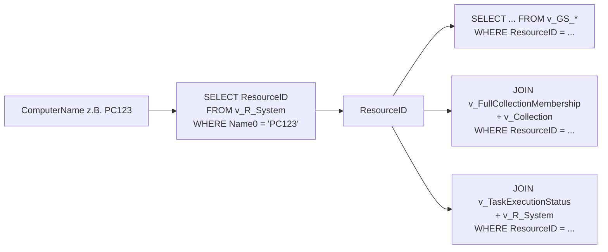
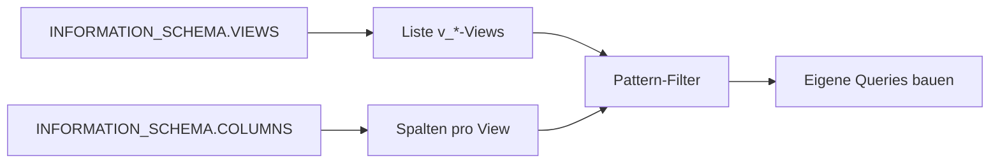

# Demo-Skripte — SQL direkt gegen CM-DB

Sammlung von 10 Skripten, die zeigen was sich aus den **`v_*`-Views der
ConfigMgr-DB** abfragen laesst. Pure bash + `sqlcmd`. Mit Kerberos-Auth
oder per `SQL_USER`/`SQL_PASS`.

## Setup

```bash
export CONFIGMGR_SQL_HOST='sql.corp.local'
export CONFIGMGR_DB_NAME='CM_P01'

# Kerberos-Auth (empfohlen):
kinit -kt /etc/krb5.keytab svc-tofu-configmgr@DOMAIN.LOCAL

# Oder SQL-Auth:
# export SQL_USER='tofu_reader'
# export SQL_PASS='...'

./010-list-devices.sh
```

Voraussetzung: `mssql-tools` (`sqlcmd`) installiert (siehe Microsoft-Doku).

## Uebersicht

| # | Skript | Was es zeigt | Genutzte Views |
|---|---|---|---|
| 010 | `010-list-devices.sh` | Device-Listing mit Filter | `v_R_System` |
| 020 | `020-device-full.sh` | Stammdaten + HW-Inventory ueber mehrere Views | `v_R_System`, `v_GS_COMPUTER_SYSTEM`, `v_GS_OPERATING_SYSTEM`, `v_GS_PC_BIOS`, `v_GS_PROCESSOR`, `v_GS_LOGICAL_DISK` |
| 030 | `030-device-software.sh` | Installierte Software | `v_GS_INSTALLED_SOFTWARE` |
| 040 | `040-device-collections.sh` | Collections eines Device | `v_FullCollectionMembership` ⋈ `v_Collection` |
| 050 | `050-collection-members.sh` | Members einer Collection | `v_FullCollectionMembership` ⋈ `v_R_System` |
| 060 | `060-deployments.sh` | Aktive UND zukuenftige Deployments | `v_DeploymentSummary` |
| 070 | `070-task-sequence-status.sh` | TS-Status-Historie | `v_TaskExecutionStatus` ⋈ `v_R_System` |
| 080 | `080-client-health.sh` | Client-Health-Summary | `v_CH_ClientSummary` |
| 090 | `090-discover-views.sh` | **Meta:** alle `v_*`-Views via `INFORMATION_SCHEMA` | `INFORMATION_SCHEMA.VIEWS`/`COLUMNS` |
| 100 | `100-complex-aggregation.sh` | Komplexer JOIN+GROUP BY-Showcase | 5 Views aggregiert |

## Was sich noch alles abfragen laesst

`090-discover-views.sh v_GS_` zeigt typischerweise rund **150 v_GS_-Views**
(Hardware-Inventory). Auswahl:

- **Discovery / Stammdaten:** `v_R_System`, `v_R_User`, `v_R_UserGroup`,
  `v_R_System_Valid`, `v_AgentDiscoveries`
- **Hardware-Inventory:** `v_GS_*` — `COMPUTER_SYSTEM`, `OPERATING_SYSTEM`,
  `PC_BIOS`, `PROCESSOR`, `LOGICAL_DISK`, `NETWORK_ADAPTER_CONFIGURATION`,
  `INSTALLED_SOFTWARE`, `ADD_REMOVE_PROGRAMS`, `BATTERY`, `MONITOR_DEVICE`
- **Software-Updates:** `v_UpdateInfo`, `v_UpdateGroupAssignment`,
  `v_UpdateContents`, `v_UpdateComplianceStatus`
- **Apps & Pakete:** `v_Applications`, `v_AppDeploymentAssetDetails`,
  `v_Package`, `v_Program`
- **Compliance:** `v_CIComplianceStatus`, `v_BaselineSummary`,
  `v_CIRelation`
- **Status / Health:** `v_StatusMessage`, `v_CH_ClientSummary`,
  `v_CombinedDeviceResources`
- **Site / Infra:** `v_Site`, `v_DistributionPoints`, `v_Boundary`,
  `v_BoundaryGroup`
- **Deployments:** `v_DeploymentSummary`, `v_AppDeploymentAssetDetails`,
  `v_TaskSequenceAdvertisementStatus`
- **Collections:** `v_Collection`, `v_FullCollectionMembership`,
  `v_CollectionRuleQuery`, `v_CollectionRuleDirect`

## Wiederkehrende Ablaeufe

### Resolve-by-Name → JOIN-Queries



`resolve_resource_id` in `_common.sh` kapselt Schritt 1.

### View-Discovery via INFORMATION_SCHEMA



Implementiert in `090-discover-views.sh` — auch mit `schema`-Modus fuer
Spalten-Listing.

## Tipps

- **`v_*`-Views sind dokumentiert**, aber nicht formal versioniert. Nach
  ConfigMgr-Major-Upgrades die genutzten Spalten gegen das aktuelle
  Schema pruefen.
- **Spalten-Suffix `0`:** Inventory-Spalten haben i.d.R. ein `0`-Suffix
  (`Name0`, `Caption0`, `Manufacturer0`). Discovery-Spalten meist ohne.
- **`WHERE`-Filter mit `N'...'`:** SQL-Server-Strings sollten Unicode
  sein (NVARCHAR), gerade fuer User-/Hostnamen mit Sonderzeichen.
- **`v_DeploymentSummary` vs. `v_Advertisement`:** ersteres ist die
  aggregierte Sicht und einfacher fuer Dashboards; letzteres die rohe,
  noch nicht aggregierte Form.
- **Niemals schreiben.** Read-only View-Account benutzen, vom DBA
  bestaetigen lassen.
- **Performance:** ein paar Views sind teuer (`v_FullCollectionMembership`
  bei vielen Collections). Bei produktivem Polling Intervalle ent-
  sprechend setzen oder aggregierte Vorschau-Views nutzen.
