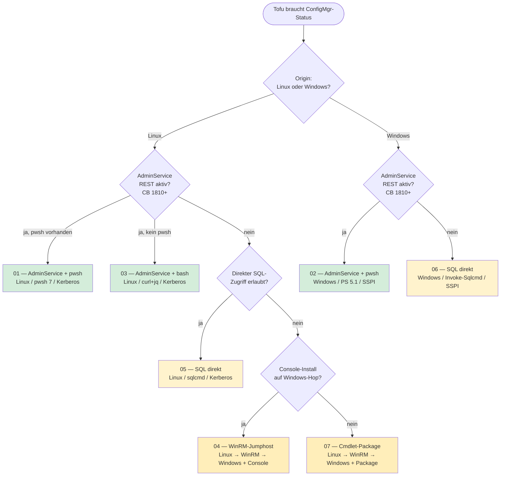
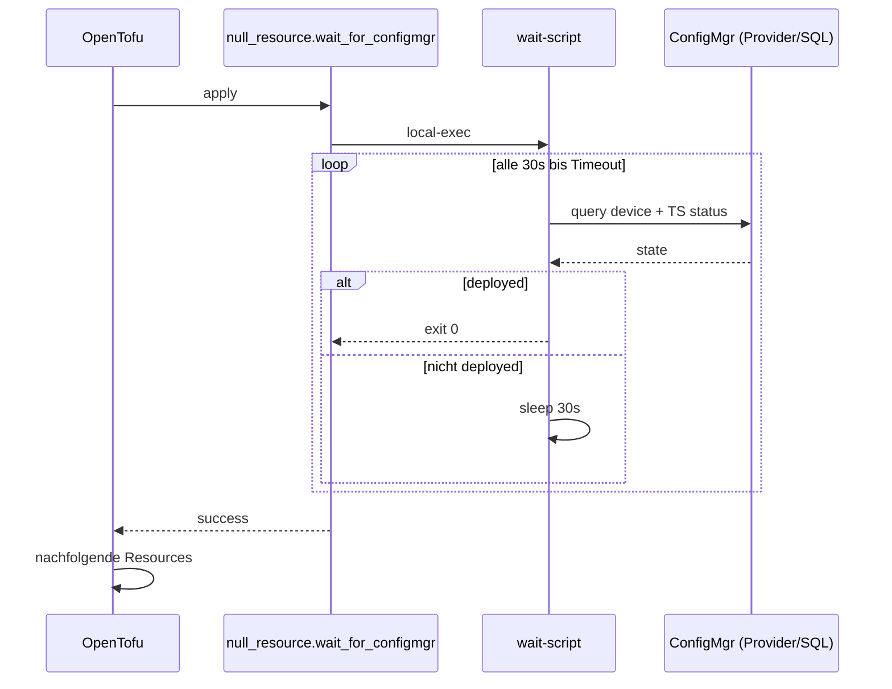
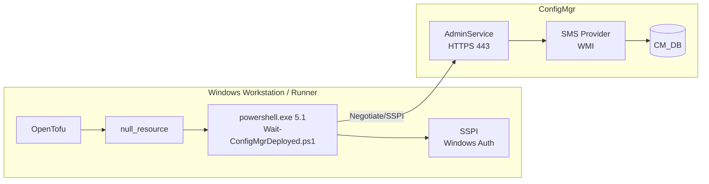
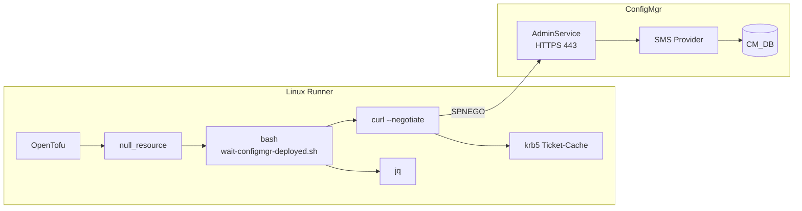
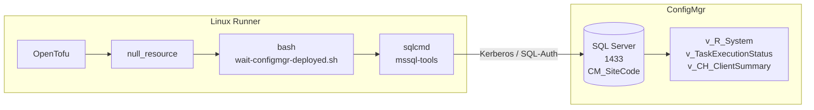
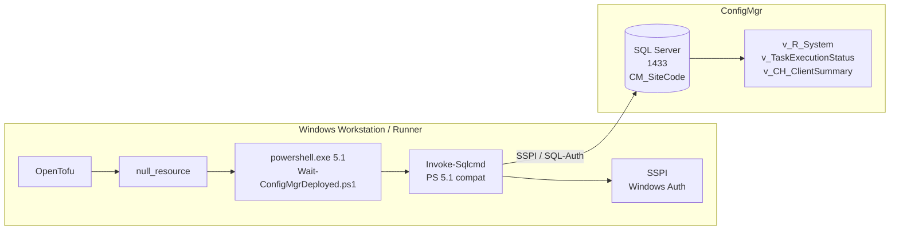
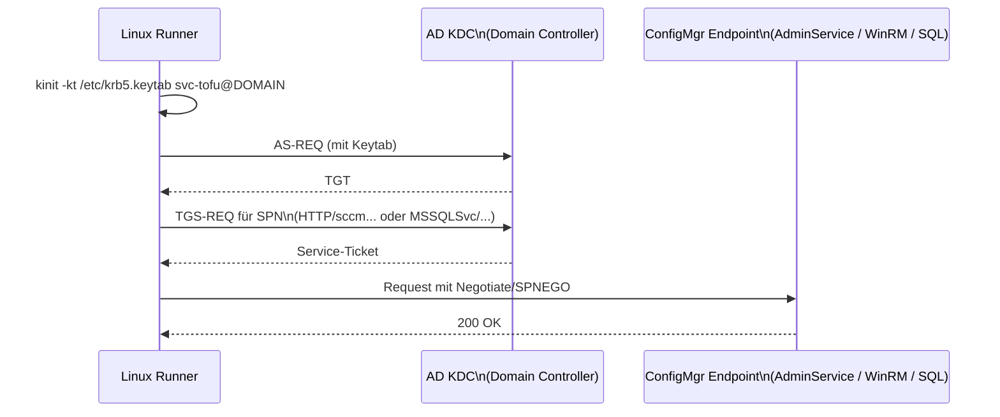

# ConfigMgr-Anbindung aus OpenTofu — Übersicht

Ziel: OpenTofu soll warten, bis ein Rechner in ConfigMgr den Status
"ausgerollt" erreicht hat, bevor Folge-Resources angelegt werden.

Sieben Wege — gruppiert nach Origin (Linux oder Windows) und Ansatz.

---

## Entscheidungsbaum

Grün = empfohlen, Gelb = funktioniert mit mehr Voraussetzungen,
Orange = mehr Moving Parts (Two-Hop, Windows-Infrastruktur nötig).

---

## Vergleichsmatrix

| # | Block | Origin | Tool / Shell | Auth | Port | PS 5.1 ausführbar | AdminService nötig | Win-Hop | Komplexität |
|---|---|---|---|---|---|---|---|---|---|
| 01 | `adminservice-pwsh-linux` | Linux | `pwsh` 7 | Kerberos (kinit/keytab) | 443 | n/a | ja (CB 1810+) | nein | mittel |
| 02 | `adminservice-pwsh-windows` | **Windows** | **PS 5.1** / pwsh 7 | **SSPI (Windows Auth)** | 443 | **ja** | ja (CB 1810+) | nein | niedrig |
| 03 | `adminservice-bash-linux` | Linux | `bash`/`curl`/`jq` | Kerberos (kinit/keytab) | 443 | n/a | ja (CB 1810+) | nein | mittel |
| 04 | `winrm-jumphost` | Linux | `pwsh` 7 | Kerberos → NTLM/Kerberos | 5986 | nein (Hop-Skripte: **ja**) | nein | **ja** | hoch |
| 05 | `sql-direct-linux` | Linux | `sqlcmd` (bash) | Kerberos / SQL-Auth | 1433 | n/a | nein | nein | niedrig |
| 06 | `sql-direct-windows` | **Windows** | **`Invoke-Sqlcmd`** | **SSPI** / SQL-Auth | 1433 | **ja** | nein | nein | niedrig |
| 07 | `cmdlets-package` | Linux | `pwsh` 7 | Kerberos → NTLM/Kerberos | 5986 | nein (Win-Skripte: **ja**) | nein | **ja** | hoch |

**PS 5.1 ausführbar — Erläuterung:**
- `n/a` = Skript läuft auf Linux (PS 5.1 gibt es nur auf Windows)
- `ja` = Skript ist PS-5.1-kompatibel geschrieben und läuft auf Windows PS 5.1
- `nein (Hop-Skripte: ja)` = das Linux-Runner-Skript nutzt pwsh 7; die Skripte
  die auf dem Windows-Hop ausgeführt werden, sind PS 5.1-kompatibel

---

## Gemeinsamer Tofu-Flow (alle Wege)

---

## Variante 01 — AdminService + PowerShell (Linux)

**Auth:** `kinit -kt /etc/krb5.keytab svc-tofu@DOMAIN` vor dem Tofu-Run.

**Vorteile:** JSON-nativ, supported, gleiche API wie die neue Console nutzt.

**Nachteile:** AdminService muss aktiviert sein (CB 1810+); pwsh-Dependency auf Linux.

---

## Variante 02 — AdminService + PowerShell (Windows)

**Auth:** `UseDefaultCredentials = $true` — greift automatisch mit dem
angemeldeten Windows-User; kein kinit, kein Keytab.

**Vorteile:** Kein Kerberos-Setup; PS 5.1 ohne Zusatzinstall; niedrigste Einstiegshürde.

**Nachteile:** AdminService muss aktiviert sein (CB 1810+); Origin muss Windows sein.

---

## Variante 03 — AdminService + Bash/curl (Linux)

**Tooling:** `curl`, `jq`, `krb5-user` — alles in jedem Linux-Repo verfügbar.

**Vorteile:** Keine pwsh-Dependency, minimaler Footprint.

**Nachteile:** Mehr Bash-Glue für Fehler-Handling und Pagination; kein Windows-Pendant.

---

## Variante 04 — WinRM-Jumphost mit CM-Console

**Auth:** Zwei-Hop: Linux → WinRM (Jumphost) → SMS-Provider. Kein Credential-
Delegation-Setup nötig, solange der Service-Account lokal auf dem Jumphost arbeitet.

**Vorteile:** Voller Cmdlet-Zugriff; funktioniert auch ohne AdminService.

**Nachteile:** Jumphost als zusätzliche Komponente; langsamer pro Poll; WinRM-HTTPS nötig.

---

## Variante 05 — SQL direkt (Linux)

**Vorteile:** Schnellste Queries; beste Join-Möglichkeiten über mehrere Views.

**Nachteile:** DBA-Approval; View-Schema kann sich bei Major-Upgrades ändern;
separater Netzwerkpfad zu SQL (1433).

---

## Variante 06 — SQL direkt (Windows)

**Gleiche SQL-Queries wie Variante 05** — nur der Client ist anders
(`Invoke-Sqlcmd` statt `sqlcmd`, Windows Auth statt Kerberos).

**Vorteile:** Kein Kerberos-Setup; PS 5.1 ohne Zusatzinstall; schnelle Queries.

**Nachteile:** DBA-Approval; View-Schema; Origin muss Windows sein.

---

## Variante 07 — WinRM + exportiertes Cmdlet-Package

**Vorteile:** Voller Cmdlet-Zugriff ohne Console-Installation; mehrere Worker
können dasselbe Package nutzen.

**Nachteile:** Package-Pflege manuell (kein Auto-Update via MSI);
rechtlich/support-technisch eine Grauzone; Cmdlet-Compatibility nach
CM-Upgrades selbst prüfen.

---

## Auth-Flow Linux → ConfigMgr (Varianten 01, 03, 05)

**Voraussetzungen:**
- Service-Account `svc-tofu` mit ConfigMgr-RBAC-Rolle "Read-only Analyst"
- Keytab erzeugt: `ktpass /princ HTTP/runner@DOMAIN /mapuser svc-tofu ...`
- SPNs auf ConfigMgr-Seite korrekt registriert

## Auth-Flow Windows → ConfigMgr (Varianten 02, 06)

Keine manuelle Konfiguration nötig. `UseDefaultCredentials = $true` /
`Invoke-Sqlcmd` ohne Credential-Parameter → SSPI verhandelt Kerberos oder
NTLM mit dem angemeldeten Windows-User automatisch.

---

## Was muss vorab geklärt werden?

1. **Origin des Runners:** Linux oder Windows? → schränkt die Optionen sofort ein.
2. **AdminService verfügbar?** → entscheidet 01/02/03 vs. 04/05/06/07.
3. **Service-Account-Strategie:** Keytab im Runner-Image? Vault-injected?
   gMSA via Workload Identity? → entscheidet Auth-Flow auf Linux.
4. **Definition "deployed":** nur TS-Erfolg, oder + Client-Health,
   + Pflicht-Apps compliant, + Compliance-Baseline?
5. **Timeout-Verhalten:** Tofu-Apply hart fehlschlagen lassen oder
   "warning + continue" mit nachgelagertem Check?
6. **Concurrency:** wie viele Rechner parallel? Polling-Intervall ggf.
   anpassen, um SMS-Provider/SQL nicht zu fluten.
