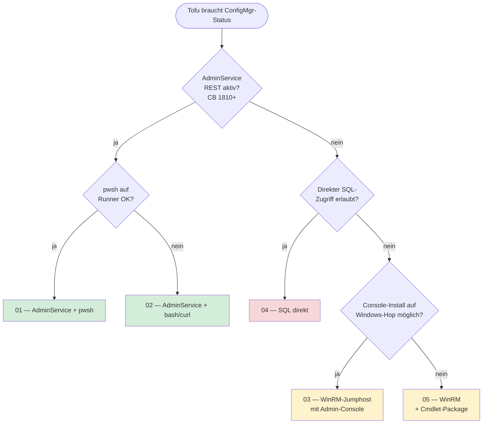
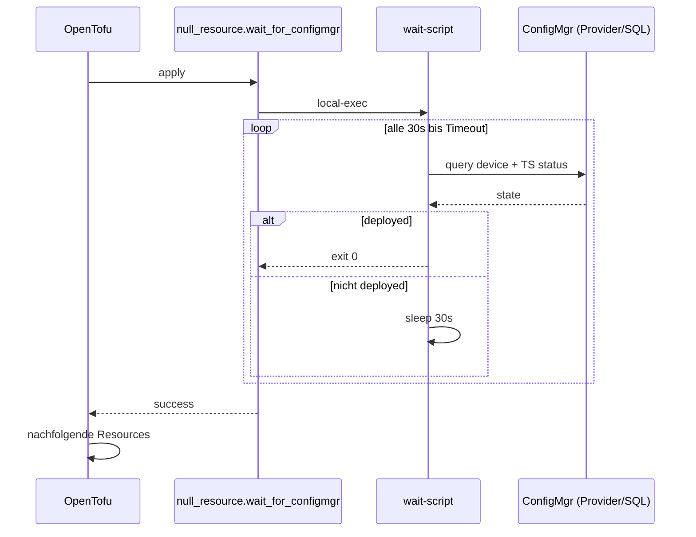
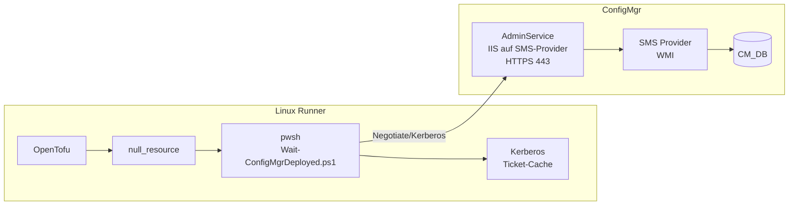
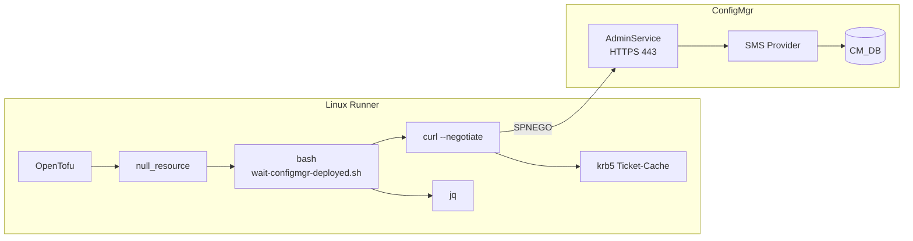
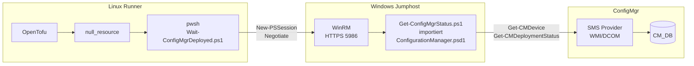
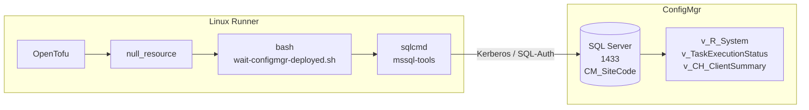
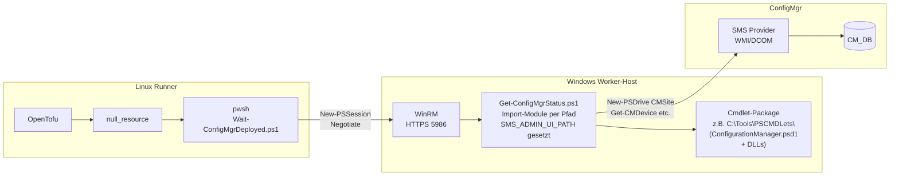
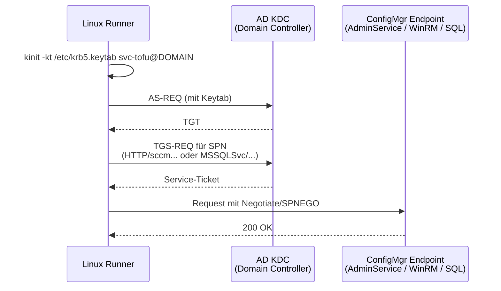

# ConfigMgr-Anbindung aus OpenTofu (Linux-Runner) — Übersicht

Ziel: OpenTofu auf einem Linux-Runner soll warten, bis ein Rechner in ConfigMgr
den Status "ausgerollt" erreicht hat, bevor Folge-Resources angelegt werden.

## Entscheidungsbaum



Grün = empfohlen, Gelb = funktioniert mit mehr Moving Parts, Rot = nur wenn
nichts anderes geht (DBA-Approval, brittler bei CM-Upgrades).

---

## Vergleichsmatrix

| Kriterium | 01 pwsh+REST | 02 bash+REST | 03 WinRM + Console | 04 SQL direkt | 05 WinRM + Cmdlet-Pkg |
|---|---|---|---|---|---|
| Linux-Runner als Origin | ✅ (mit pwsh) | ✅ | ✅ (mit pwsh) | ✅ | ✅ (mit pwsh) |
| Windows-Hop nötig | nein | nein | **ja (Console)** | nein | **ja (nur Package)** |
| Microsoft-supported | ✅ | ✅ | ✅ | ⚠️ Views ja, Schema nein | ⚠️ Cmdlets ja, Package-Distribution semi-offiziell |
| Latenz pro Poll | ~1-2s | ~1-2s | ~3-5s (Hop) | <500ms | ~3-5s (Hop) |
| Ports nach außen | 443 | 443 | 5986 | 1433 | 5986 |
| Setup-Aufwand | mittel | mittel | hoch | niedrig | mittel-hoch |
| Berechtigungs-Granularität | RBAC AdminService | RBAC AdminService | volles ConfigMgr-RBAC | DB-Read | volles ConfigMgr-RBAC |
| Cmdlet-Funktionsumfang | begrenzt (REST-Subset) | begrenzt (REST-Subset) | voll (`Get-CM*` etc.) | irrelevant (SQL) | voll (`Get-CM*` etc.) |
| Min. ConfigMgr-Version | 1810 | 1810 | jede | jede (View-Stabilität CB-abhängig) | jede |
| Risiko bei CM-Upgrade | gering | gering | gering | mittel (View-Schema) | mittel (Cmdlet-Compat im Package) |
| Wartung Windows-Komponente | n/a | n/a | MS-Update-Pfad (MSI) | n/a | manuelle Package-Pflege |

---

## Gemeinsamer Tofu-Flow (alle Wege)



---

## Variante 01 — AdminService + PowerShell 7



**Cmdlets/Calls:**
- `Invoke-RestMethod -UseDefaultCredentials -Uri https://.../AdminService/wmi/SMS_R_System?$filter=...`
- `Invoke-RestMethod -UseDefaultCredentials -Uri https://.../AdminService/wmi/SMS_TaskSequenceDeploymentStatus?$filter=...`

**Vorteile:** JSON-nativ, supported, gleiche API wie die neue Console nutzt.
**Nachteile:** AdminService muss aktiviert sein (CB 1810+, IIS-Konfig); pwsh-Dependency.

---

## Variante 02 — AdminService + Bash/curl



**Tooling:** `curl`, `jq`, `krb5-user` — alles in jedem Linux-Repo verfügbar.

**Vorteile:** Keine pwsh-Dependency, minimaler Footprint.
**Nachteile:** Mehr Bash-Glue für Fehler-Handling und Pagination.

---

## Variante 03 — WinRM-Jumphost mit ConfigurationManager-Modul



**Zwei-Hop-Auth:** Linux → WinRM (Jumphost) → SMS-Provider. Letzteres läuft
mit dem Service-Account der WinRM-Session — kein Delegation-Setup nötig,
solange das Konto auf dem Jumphost lokal arbeitet.

**Vorteile:** Voller Cmdlet-Zugriff (`Get-CMDevice`, `Get-CMCollection`,
`Get-CMDeployment` etc.); funktioniert auch ohne AdminService.
**Nachteile:** Jumphost als zusätzliche Komponente, langsamer pro Poll,
WinRM-HTTPS muss eingerichtet sein.

---

## Variante 04 — SQL direkt gegen CM-Datenbank



**Genutzte Views (offiziell dokumentiert):**
- `v_R_System` — Resource-Stammdaten, `Client0`
- `v_TaskExecutionStatus` — TS-Run-Historie
- `v_CH_ClientSummary` — Client-Health (optional)

**Vorteile:** Schnellste Queries, beste Join-Möglichkeiten.
**Nachteile:** Nur lesend, DBA-Approval, View-Schema kann sich bei
Major-Upgrades ändern, separater Netzwerkpfad zur SQL.

---

## Variante 05 — WinRM + exportiertes Cmdlet-Package



**Konzept:** Wie Variante 03, aber der Windows-Host braucht **keine
vollständige Admin-Console-Installation** — nur das exportierte Cmdlet-Package
in einem beliebigen Ordner. Setup einmalig per `Setup-CmdletPackage.ps1`:

```powershell
Import-Module C:\Tools\PSCMDLets\ConfigurationManager.psd1
$env:SMS_ADMIN_UI_PATH = 'C:\Tools\PSCMDLets'
New-PSDrive -Name <SiteCode> -PSProvider CMSite -Root <sms-provider-fqdn>
```

**Package-Beschaffung:** Microsoft liefert das Package nicht direkt. Üblich:
selbst erzeugen via [garytown — CreateCMPowerShellModulePackage.ps1](https://github.com/gwblok/garytown/blob/master/CreateCMPowerShellModulePackage.ps1)
oder Inhalt aus `…\AdminUI\bin\` einer existierenden Installation
extrahieren (siehe [garrettyamada-Artikel](https://garrettyamada.com/posts/connecting-to-sccm-using-powershell)).

**Vorteile:** Voller Cmdlet-Zugriff wie Variante 03; minimaler Footprint
auf dem Windows-Hop; mehrere Worker können dasselbe Package nutzen.
**Nachteile:** Package-Pflege manuell (kein Auto-Update via MSI); rechtlich/
support-technisch eine Grauzone, da Package nicht offiziell distribuiert wird;
Cmdlet-Compatibility nach CM-Upgrades selbst prüfen.

---

## Auth-Flow (Linux → ConfigMgr)

Gleich für Variante 01, 02, 04 (Kerberos) und sinngemäß für 03/05:



**Voraussetzungen im AD/ConfigMgr:**
- Service-Account `svc-tofu` mit ConfigMgr-RBAC-Rolle "Read-only Analyst"
  (oder spezifischer)
- Keytab erzeugt: `ktpass /princ HTTP/runner@DOMAIN /mapuser svc-tofu ...`
- SPNs auf ConfigMgr-Seite korrekt registriert (für AdminService normalerweise
  automatisch via IIS-Computerkonto)

---

## Was muss vorab geklärt werden?

1. **AdminService verfügbar?** → entscheidet 01/02 vs 03/04
2. **Service-Account-Strategie:** Keytab im Runner-Image? Vault-injected?
   gMSA via [Microsoft AAD Workload Identity]? → entscheidet Auth-Flow
3. **Definition "deployed":** nur TS-Erfolg, oder + Client-Health,
   + Pflicht-Apps compliant, + Compliance-Baseline?
4. **Timeout-Verhalten:** Tofu-Apply hart fehlschlagen lassen oder
   "warning + continue" mit nachgelagertem Check?
5. **Concurrency:** wie viele Rechner parallel? Polling-Intervall ggf.
   anpassen, um SMS-Provider/SQL nicht zu fluten.
