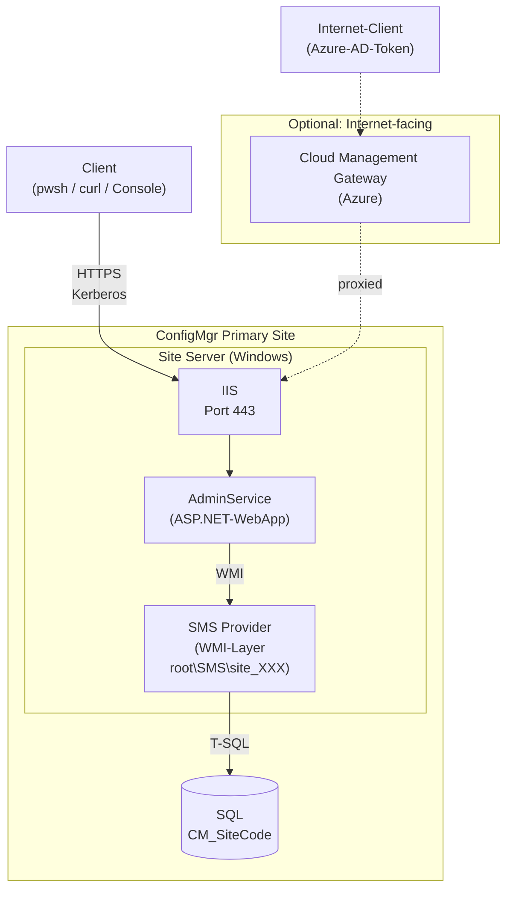
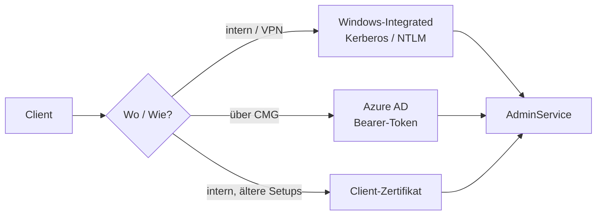

# ConfigMgr AdminService — Architektur & Nutzung

## Was ist der AdminService?

REST-API, eingeführt mit **ConfigMgr Current Branch 1810** (Q4 2018) als
moderner Ersatz für direkten WMI/SMS-Provider-Zugriff. Die ConfigMgr-Console
(ab Version ~2020) nutzt sie selbst intern.

- **Protokoll:** HTTPS, JSON
- **Spec:** OData v4 (Standard-Operatoren `$filter`, `$select`, `$top`,
  `$orderby`, `$expand`)
- **Default-Port:** 443
- **Versionsverlauf:** mit jedem CB-Release weiter ausgebaut, primär der
  `v1.0`-Namespace

## Wo läuft er?

Kein eigener Server, sondern eine **ASP.NET-WebApp im IIS auf der
SMS-Provider-Rolle**. In Standard-Installationen läuft die SMS-Provider-Rolle
auf dem Site-Server selbst, kann aber auch auf separate Server verlagert sein.



**Konkret auf dem Site-Server:**

| Komponente | Ort |
|---|---|
| Installations-Pfad | `C:\Program Files\Microsoft Configuration Manager\AdminUI\WebSite\` |
| IIS-Application | virtuelles Verzeichnis `AdminService` unter "Default Web Site" |
| Windows-Service | `SMS_REST_PROVIDER` |

Bei mehreren SMS-Providern hat **jeder** seinen eigenen AdminService-Endpoint;
Load-Balancing meist via DNS-Round-Robin oder NLB.

## Aktivierung in der MECM-Konsole

Der AdminService ist **nicht standardmäßig aktiv** — er wird zwar mit der
SMS-Provider-Rolle installiert, antwortet aber erst, wenn Enhanced HTTP oder
PKI-HTTPS konfiguriert ist.

### Schritt 1 — Enhanced HTTP aktivieren

**Administration → Site Configuration → Sites → [Site auswählen] →
Properties → Communication Security**

Option aktivieren: **"Use Configuration Manager-generated certificates for
HTTP site systems"**

Das lässt MECM selbst-signierte Zertifikate für Site-Systeme ausstellen.
Der AdminService nutzt dieses Zertifikat für seinen IIS-Endpoint.

> **Alternativ (seltener):** Full PKI — Site-Systeme haben bereits
> CA-signierte IIS-Zertifikate. Dann ist eHTTP nicht nötig, aber auch
> kein Blocker.

### Schritt 2 — SMS Provider-Rolle prüfen

**Administration → Site Configuration → Servers and Site System Roles**

Den SMS-Provider-Server auswählen und sicherstellen, dass die Rolle
**SMS Provider** vorhanden ist. Der AdminService läuft immer auf demselben
Host wie die SMS-Provider-Rolle.

### Aktivierung verifizieren

Auf dem Site-Server (PowerShell):

```powershell
Get-Service SMS_REST_PROVIDER
# Status muss 'Running' sein

Get-WebApplication -Name AdminService
# muss existieren; PhysicalPath zeigt auf CM AdminUI\WebSite
```

Vom Client (nach Schritt 1):

```bash
curl -k -I https://<sms-provider-fqdn>/AdminService/
# HTTP/1.1 401  →  Endpoint aktiv, Auth fehlt noch  ✓
# HTTP/1.1 403  →  Enhanced HTTP nicht aktiv         ✗
# Verbindungsfehler  →  IIS läuft nicht / Firewall    ✗
```

### Häufige Stolperfallen

| Symptom | Ursache | Lösung |
|---|---|---|
| HTTP 403 | Enhanced HTTP nicht aktiviert | Schritt 1 durchführen |
| HTTP 401 (dauerhaft) | RBAC-Recht fehlt | ConfigMgr-Rolle "Read-only Analyst" zuweisen |
| Zertifikat-Fehler (Linux) | Selbst-signiertes Cert nicht vertraut | Interne CA in System-Trust-Store importieren |
| `SMS_REST_PROVIDER` stopped | Dienst nach CM-Update neu starten | `Start-Service SMS_REST_PROVIDER` |

---

## URL-Struktur

```
https://<sms-provider-fqdn>/AdminService/<namespace>/<resource>
```

Es gibt **zwei parallele Namespaces**:

| Namespace | Inhalt | Beispiel | Reife |
|---|---|---|---|
| `/AdminService/wmi/` | 1:1-Mapping aller SMS-Provider-WMI-Klassen | `…/wmi/SMS_R_System` | stabil, vollständig |
| `/AdminService/v1.0/` | Kuratierte "modeled" REST-Resources | `…/v1.0/Device(12345)` | wächst pro Release |

**Faustregel:** Für unbekannte Daten zuerst `wmi/` nehmen — alles, was per
WMI verfügbar ist, ist auch dort. `v1.0/` nutzen, wenn die passende Resource
existiert (sauberer, weniger Felder).

## Request-Beispiele

### Device per Name suchen
```bash
curl --negotiate -u : \
  -H 'Accept: application/json' \
  "https://sccm.corp.local/AdminService/wmi/SMS_R_System?\$filter=Name eq 'PC123'&\$select=ResourceID,Name,Client"
```

### Task-Sequence-Status für ResourceID
```bash
curl --negotiate -u : \
  -H 'Accept: application/json' \
  "https://sccm.corp.local/AdminService/wmi/SMS_TaskSequenceDeploymentStatus?\$filter=ResourceID eq 16777345&\$orderby=StatusTime desc"
```

### Modeled API: einzelnes Device
```bash
curl --negotiate -u : \
  "https://sccm.corp.local/AdminService/v1.0/Device(16777345)"
```

### Response-Schema (OData)
```json
{
  "@odata.context": "https://sccm.corp.local/AdminService/wmi/$metadata#SMS_R_System",
  "value": [
    {
      "ResourceID": 16777345,
      "Name": "PC123",
      "Client": 1
    }
  ]
}
```

## Authentifizierung

Drei unterstützte Modi:



- **Windows-Integrated (Negotiate/Kerberos)** — Default für interne Clients.
  Vom Linux-Runner per Keytab + `kinit` lösbar.
- **Azure AD (Bearer-Token)** — wenn die Site mit Cloud Management Gateway
  internetfähig ist; Token via App-Registration im Tenant.
- **Client-Zertifikat** — selten, primär für ältere oder
  hochsicherheits-Setups.

## Berechtigungs-Modell

Der AdminService nutzt das **gleiche RBAC-System wie die ConfigMgr-Console**.
Kein separates Permission-Setup — nur eine ConfigMgr-Rolle für den Service-Account
(z.B. "Read-only Analyst" oder eine custom Role mit eingeschränktem Scope auf
bestimmte Collections / Sicherheitsbereiche).

## Verfügbarkeit prüfen

Vom Linux-Runner (oder beliebigem Client):

```bash
# 1. Erreichbar?
curl -k -I https://sccm.corp.local/AdminService/

# 2. Antwortet er JSON nach Auth?
curl -k --negotiate -u : https://sccm.corp.local/AdminService/wmi/

# 3. RBAC ok? (sollte Site-Info liefern)
curl -k --negotiate -u : "https://sccm.corp.local/AdminService/wmi/SMS_Site"
```

Auf dem Site-Server selbst:

```powershell
Get-Service SMS_REST_PROVIDER          # sollte 'Running' sein
Get-WebApplication -Name AdminService  # sollte existieren
```

## Limits & Stolperfallen

- **Pagination:** Default-Page-Size ist begrenzt (üblicherweise 1000). Bei
  größeren Result-Sets `@odata.nextLink` folgen.
- **Komplexe WMI-Lazy-Properties** (Embedded-Objects) werden nicht immer
  vollständig serialisiert — im Zweifel `wmi/` mit explizitem `$select`
  nutzen oder auf SQL-View ausweichen.
- **Schreibende Operationen** (POST/PUT) sind möglich, aber für Read-Only-
  Use-Cases wie unseren irrelevant — sauber halten und nur GET nutzen.
- **Zertifikat:** Das IIS-Site-Zertifikat muss vom Linux-Runner als
  vertrauenswürdig anerkannt werden — entweder die interne CA in den
  System-Trust-Store importieren oder (nur für Tests) `-k` / `--insecure`.
