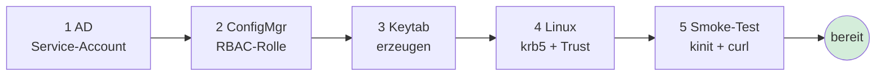

# Auth-Setup — Linux-Runner ↔ ConfigMgr

Konkretes Kochbuch fuer alle vier Bausteine, die zwischen "Service-Account
existiert" und "AdminService-Call funktioniert vom Linux-Runner" liegen.
Geeignet zum 1:1-Durcharbeiten mit AD-Admin und MECM-Admin.

## Überblick



Jeder Schritt ist isoliert verifizierbar (siehe Smoke-Tests am Ende).

## 1. Service-Account in AD anlegen

Auf einem DC oder einer Maschine mit RSAT (`ActiveDirectory`-Modul):

```powershell
$pw = Read-Host -AsSecureString -Prompt 'Passwort'
New-ADUser `
    -Name 'svc-tofu-configmgr' `
    -SamAccountName 'svc-tofu-configmgr' `
    -UserPrincipalName 'svc-tofu-configmgr@DOMAIN.LOCAL' `
    -AccountPassword $pw `
    -Enabled $true `
    -PasswordNeverExpires $true `
    -Description 'OpenTofu wait-for-ConfigMgr (Linux runner)'

# AES-256 erzwingen — DES/RC4 sind schwach und in vielen AD-Umgebungen
# ohnehin per Default-Policy deaktiviert
Set-ADUser -Identity 'svc-tofu-configmgr' `
    -KerberosEncryptionType 'AES256'
```

**Wichtig:** Kein "Pre-Authentication required = false" setzen
(Kerberoasting-Risiko). Account in eine OU verschieben, die nicht
unter Auto-Lockout-Policy fuer interaktive Logins steht.

## 2. ConfigMgr-RBAC-Rolle zuweisen

Per Console: **Administration → Security → Administrative Users → Add User**.
Per PowerShell auf dem Site-Server (mit ConfigurationManager-Modul + PSDrive):

```powershell
New-CMAdministrativeUser `
    -Name 'DOMAIN\svc-tofu-configmgr' `
    -RoleName 'Read-only Analyst'
```

**Empfohlen:** statt der Built-in "Read-only Analyst" eine **Custom Role**
mit eingeschraenktem **Security Scope** auf nur die Collections, die das
Tooling sehen soll. Reduziert Blast-Radius bei Credential-Leak.

Pruefen:
```powershell
Get-CMAdministrativeUser -Name 'DOMAIN\svc-tofu-configmgr' |
    Select-Object LogonName, RoleNames, CollectionNames
```

## 3. Keytab erzeugen

Zwei sichere Wege.

### 3a. Auf Windows mit `ktpass` (klassisch)

```cmd
ktpass -princ svc-tofu-configmgr@DOMAIN.LOCAL ^
       -mapuser DOMAIN\svc-tofu-configmgr ^
       -pass * ^
       -ptype KRB5_NT_PRINCIPAL ^
       -crypto AES256-SHA1 ^
       -out C:\temp\svc-tofu.keytab
```

⚠️ **Achtung:** `ktpass` kann das AD-Passwort mit-rotieren. Nach Abschluss
ggf. das in AD gespeicherte Passwort manuell auf den Wert zuruecksetzen,
den man fuer den Keytab nutzen will — sonst wandert AD und Keytab ausein-
ander, und `kinit` schlaegt mit `Preauthentication failed` fehl.

### 3b. Auf Linux mit `ktutil` (kein ktpass-Side-Effect)

```bash
ktutil <<'EOF'
add_entry -password -p svc-tofu-configmgr@DOMAIN.LOCAL -k 1 -e aes256-cts-hmac-sha1-96
<password eingeben>
write_kt /etc/krb5.keytab
quit
EOF
chmod 600 /etc/krb5.keytab
chown root:root /etc/krb5.keytab
```

Das AD-Passwort bleibt unangetastet — der Keytab wird lokal aus dem
bekannten Passwort erzeugt. Voraussetzung: Passwort ist bekannt UND wird
in AD nicht regelmaessig rotiert (oder Keytab wird parallel mitrotiert).

## 4. Linux-Konfiguration

### 4a. Kerberos (`/etc/krb5.conf`)

```ini
[libdefaults]
    default_realm = DOMAIN.LOCAL
    dns_lookup_realm = false
    dns_lookup_kdc = true
    rdns = false
    forwardable = true
    udp_preference_limit = 1
    default_ccache_name = KEYRING:persistent:%{uid}

[realms]
    DOMAIN.LOCAL = {
        kdc = dc01.domain.local
        kdc = dc02.domain.local
        admin_server = dc01.domain.local
        default_domain = domain.local
    }

[domain_realm]
    .domain.local = DOMAIN.LOCAL
    domain.local  = DOMAIN.LOCAL
```

`DOMAIN.LOCAL` und KDC-FQDNs auf eure Realitaet anpassen. Realm-Name ist
case-sensitive konventionell **GROSS**.

### 4b. Keytab platzieren

```bash
sudo install -o root -g root -m 0600 svc-tofu.keytab /etc/krb5.keytab
# oder pro-User unter ~/.k5loginkeytab — fuer System-Runner /etc/ besser
```

### 4c. CA / TLS-Trust

Wenn das Site-Zertifikat des SMS-Providers von einer **internen CA**
ausgestellt wurde, muss diese in den System-Trust importiert werden:

```bash
# Debian / Ubuntu
sudo cp internal-root-ca.crt /usr/local/share/ca-certificates/
sudo update-ca-certificates

# RHEL / Rocky / Alma
sudo cp internal-root-ca.crt /etc/pki/ca-trust/source/anchors/
sudo update-ca-trust
```

Verify:
```bash
openssl verify -CAfile /etc/ssl/certs/ca-certificates.crt internal-root-ca.crt
curl --head https://sccm.corp.local/AdminService/   # darf nicht TLS-failen
```

Quick-and-dirty Alternative (nur Test): `--insecure`/`-k` bzw. die
Env-Variable `CONFIGMGR_SKIP_CERT_CHECK=true` fuer die Demo-Skripte.
**Niemals** in Prod.

## 5. Smoke-Test-Kette

Jeder Schritt einzeln verifizierbar — wenn was bricht, weisst du wo.

```bash
# 5a. Kerberos-Ticket holen
kinit -kt /etc/krb5.keytab svc-tofu-configmgr@DOMAIN.LOCAL
echo $?    # 0 = ok

# 5b. Ticket sichtbar?
klist
# Erwartet: krbtgt/DOMAIN.LOCAL@DOMAIN.LOCAL Ticket

# 5c. SPN-Resolve fuer den AdminService
kvno HTTP/sccm.corp.local@DOMAIN.LOCAL
# Erwartet: 'kvno = N' ohne Fehler

# 5d. AdminService erreichbar (nur HTTP, ohne Auth)
curl -I https://sccm.corp.local/AdminService/

# 5e. AdminService mit Auth — die Lackmus-Probe
curl --negotiate -u : -H 'Accept: application/json' \
     https://sccm.corp.local/AdminService/wmi/SMS_Site
# Erwartet: 200 OK + JSON mit SiteCode/Version

# 5f. Demo-Skript fahren
export CONFIGMGR_ADMINSERVICE_BASE='https://sccm.corp.local/AdminService'
./01-adminservice-pwsh-linux/Demo-pwsh7/010-list-devices.ps1 -Top 5
```

## 6. Troubleshooting

| Symptom | Wahrscheinliche Ursache | Fix |
|---|---|---|
| `kinit: Preauthentication failed` | Passwort in AD ≠ Keytab-Passwort | Keytab neu erzeugen, ggf. AD-PW zuruecksetzen |
| `kinit: KDC reply did not match expectations` | Realm-Name falsch (case-sensitiv) oder krb5.conf-Realm-Block falsch | Realm in krb5.conf pruefen, GROSS schreiben |
| `kvno: KRB5_AP_ERR_MODIFIED` | SPN existiert auf falschem AD-Konto / falscher SPN angefragt | `setspn -L <hostname>` auf Site-Server, ggf. `setspn -A HTTP/host` |
| `curl: (60) SSL certificate problem` | Interne CA nicht im System-Trust | Schritt 4c wiederholen / verifizieren |
| `curl: (35) gnutls_handshake() failed` | TLS-Version-Mismatch (sehr alte/neue IIS-Konfig) | `curl --tls-max 1.2` testen, sonst CA / Cipher-Suite pruefen |
| `401 Unauthorized` trotz erfolgreichem `kinit` | SPN-Mismatch (AdminService-URL ≠ SPN-Hostname) ODER RBAC fehlt | URL-Hostname EXAKT zum SPN, RBAC-Rolle pruefen |
| `403 Forbidden` | RBAC-Rolle erlaubt die Resource nicht | Scope der Rolle erweitern oder Scope auf Collection korrigieren |
| `500 Server Error`, alles richtig | SMS_REST_PROVIDER-Service nicht laeuft | `Get-Service SMS_REST_PROVIDER` auf Site-Server |
| `kinit` ok, aber `curl` macht NTLM statt Negotiate | Hostname in URL ≠ FQDN | Immer FQDN benutzen, nicht Short-Name oder IP |

## 7. Dauerbetrieb / Pipeline-Integration

- **Keytab-Rotation:** Keytab spiegelt AD-Passwort. Wenn AD-Passwort
  rotiert wird, Keytab parallel neu erzeugen und im Runner-Image
  aktualisieren. Pattern: Rotation-Job in geheimem Vault oder
  Secret-Store, Runner-Pod mountet aktuellen Keytab.
- **gMSA als Alternative:** Group Managed Service Accounts werden
  automatisch von AD rotiert. Auf Linux: `realmd`-Join + `aklog`/
  Workload-Identity-Pattern. Komplexer, aber wartungsaermer.
- **Azure-AD-Token statt Kerberos:** wenn die Site ueber CMG erreichbar
  ist. Fuer reine internet-only Runner (z.B. Cloud-CI) attraktiver als
  Kerberos.
- **Token-Cache pro Runner-Job:** `KRB5CCNAME=FILE:/tmp/krb5cc_$$`
  setzen, damit parallele Jobs sich nicht den Default-Cache teilen.

## 8. Sicherheits-Checkliste

- [ ] Service-Account hat **kein** "Pre-Auth disabled"
- [ ] AES256 als Encryption-Type erzwungen
- [ ] RBAC-Rolle ist Read-only und so eng wie moeglich gescoped
- [ ] Keytab nur fuer `root` lesbar (`chmod 600`)
- [ ] Internal-CA-Cert ist im System-Trust, nicht nur per `--insecure`
- [ ] FQDNs konsistent (URL = SPN-Hostname = `krb5.conf`-Eintraege)
- [ ] Keytab-Rotation in der Runner-Pipeline geplant
- [ ] Audit-Logging in MECM/AD aktiv (verraet Missbrauch frueh)
