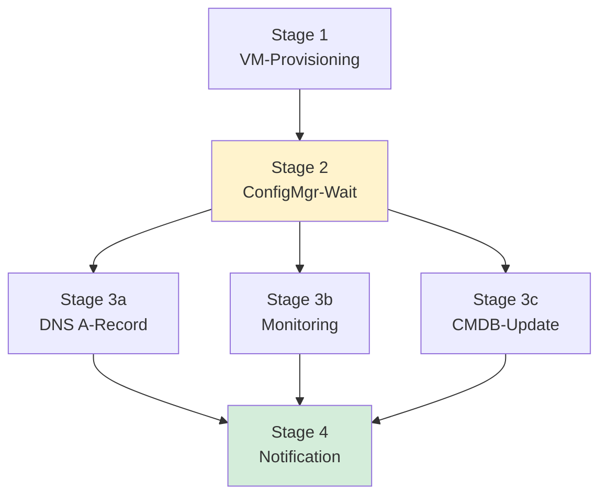
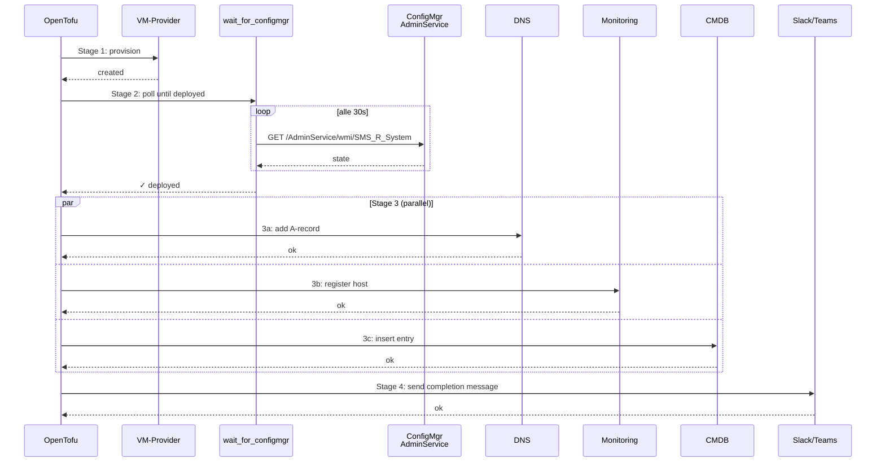

# Beispiel — Full-VM-Rollout End-to-End

Realistischer Tofu-Stack, der den **kompletten Lifecycle** einer neuen VM
abbildet: Provisioning → ConfigMgr-Deployment-Wait → parallele Folge-Tasks
(DNS, Monitoring, CMDB) → Final-Notification.

## Pipeline



Tofu fuehrt Stage 3a/3b/3c **parallel** aus (sie haengen nur an Stage 2,
nicht voneinander). Stage 4 wartet auf alle drei.

## Sequenz im Detail



## Warum dieser Aufbau?

Der entscheidende Punkt ist **Stage 2 als Gate**: ohne den ConfigMgr-Wait
wuerden Folge-Tasks zu frueh laufen — der Rechner haette evtl. noch keinen
korrekten Hostnamen, waere nicht in der Domain, haette keinen Monitoring-
Agent, waere noch im Imaging-Setup. DNS-Eintraege auf eine "halbfertige"
Maschine sind ein klassischer Fehler in selbstgebauten Pipelines.

`depends_on = [module.wait_for_configmgr]` macht das Gate explizit. Tofu
parallelisiert dahinter automatisch alles, was unabhaengig ist.

## Ausfuehrung (Demo-Modus)

```bash
cd examples/full-vm-rollout
cp terraform.tfvars.example terraform.tfvars
# computer_name, sms_provider, site_code anpassen
tofu init
tofu apply
```

Im Default-Modus (`dry_run = true`) loggt jedes Stage-Skript nur, was es
tun WUERDE — keine echten API-Calls. Sicher zum Anschauen + Verstehen.

## Beispiel-Output (dry-run)

```
null_resource.stage1_vm_create: Creating...
[2026-04-30T15:42:01+02:00] STAGE 1 → VM 'PC-DEMO-001' provisionieren
  (dry-run) wuerde Provider-API aufrufen und VM erstellen
[2026-04-30T15:42:02+02:00] STAGE 1 ✓ VM bereit, ConfigMgr uebernimmt jetzt

module.wait_for_configmgr.null_resource.wait_for_configmgr: Creating...
[2026-04-30T15:42:03+02:00] PC-DEMO-001 → {... ClientReady: True, TsStatus: 5}
DEPLOYED

null_resource.stage3a_dns: Creating...
null_resource.stage3b_monitoring: Creating...
null_resource.stage3c_cmdb: Creating...
... (parallel) ...

null_resource.stage4_notify: Creating...
[2026-04-30T15:48:30+02:00] STAGE 4 → Notification an #ops-rollout
[2026-04-30T15:48:30+02:00] STAGE 4 ✓ Rollout-Pipeline abgeschlossen

Outputs:
fqdn = "PC-DEMO-001.corp.local"
hostname = "PC-DEMO-001"
rollout_complete_id = "1234567890123456789"
```

## Real-Mode aktivieren

`dry_run = false` setzen — dann brechen die Stage-Skripte mit einem
deutlichen Fehler ab und zeigen, wo der echte Provider-Code hin muss.

**Empfehlung:** statt die bash-Skripte zu erweitern, die `null_resource`-
Bloecke durch echte Provider-Resources ersetzen. Beispiele in der
Tabelle unten.

## Swap-In-Points pro Stage

| Stage | Aktuell (Demo) | Real-Provider-Beispiele |
|---|---|---|
| 1 VM-Create | `null_resource` + `01-create-vm.sh` | `vsphere_virtual_machine`, `libvirt_domain`, `proxmox_vm_qemu`, `aws_instance`, `azurerm_virtual_machine` |
| 2 ConfigMgr-Wait | `module.wait_for_configmgr` (= 01-adminservice-pwsh-linux) | bleibt — oder Modul-Source auf 02/03/04/05/06/07 wechseln |
| 3a DNS | `null_resource` + `03a-add-dns.sh` | `cloudflare_record`, `powerdns_record`, `dns_a_record_set`, `infoblox_a_record`, `aws_route53_record` |
| 3b Monitoring | `null_resource` + `03b-register-monitoring.sh` | `icinga2`-API, `datadog_host`, `zabbix_host`, Prometheus `file_sd` |
| 3c CMDB | `null_resource` + `03c-update-cmdb.sh` | ServiceNow REST, iTop REST, `netbox_device`, `snipeit`-API |
| 4 Notify | `null_resource` + `04-notify.sh` | `mailgun_route`, Slack-Webhook (curl), MS Teams Webhook, PagerDuty |

## Wenn das ConfigMgr-Wait fehlschlaegt

Tofu bricht ab — Stage 3 + 4 laufen nicht. Recovery:

1. ConfigMgr-Console: warum ist die Task-Sequence fehlgeschlagen?
2. ggf. manuell fixen, dann `tofu apply` erneut → Wait laeuft weiter,
   Folgestages starten sobald deployed.
3. Wenn die VM ganz neu provisioniert werden muss: `tofu taint
   null_resource.stage1_vm_create` und neu `apply`.

## Erweitern

Weitere parallele Stage-3-Tasks sind trivial: einfach noch eine
`null_resource` mit `depends_on = [module.wait_for_configmgr]` und in die
`depends_on`-Liste von `stage4_notify` aufnehmen. Beispiele:

- **3d:** Backup-Eintrag (Veeam-API, Bareos-Config-Generator)
- **3e:** Ticket schliessen (Jira/ServiceNow)
- **3f:** Patch-Group-Membership in WSUS / Update-Group in ConfigMgr setzen
- **3g:** Compliance-Baseline initial pruefen (`Get-CMComplianceState`)
